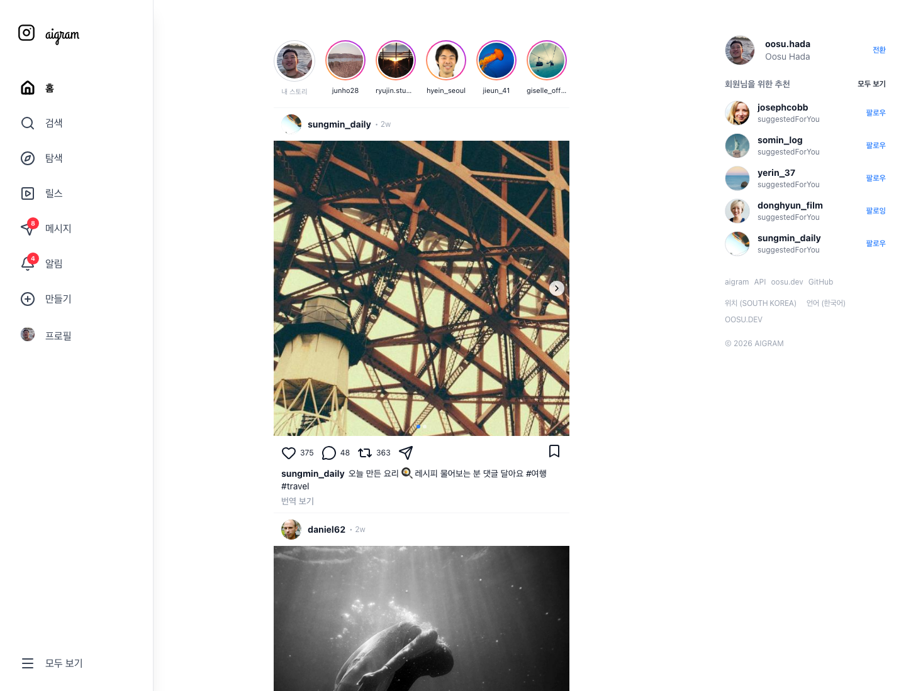
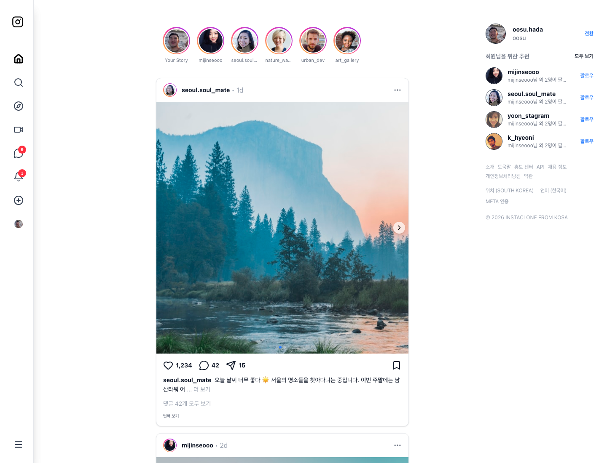
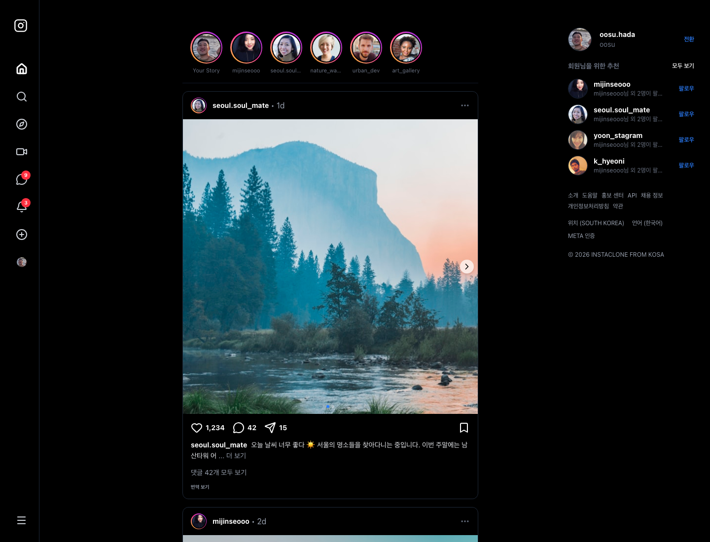
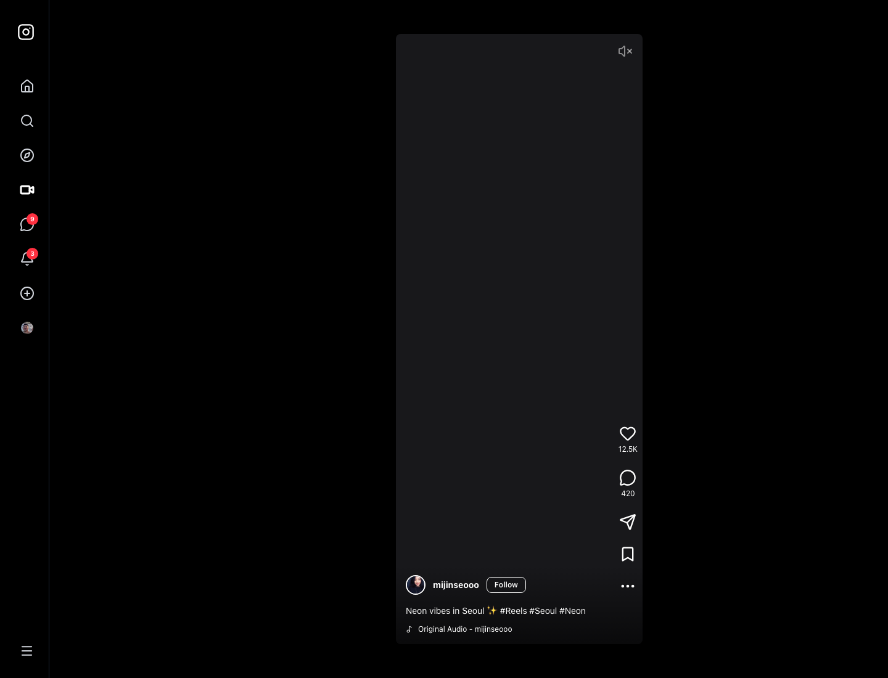
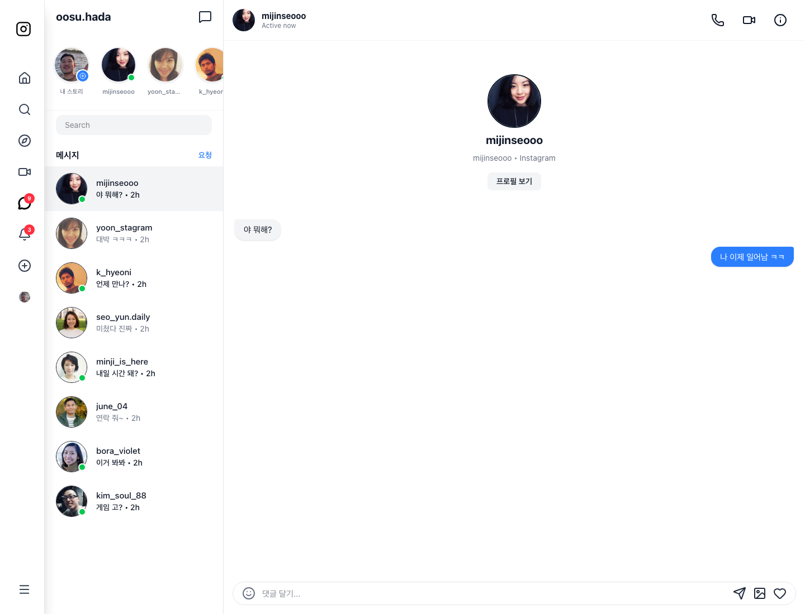
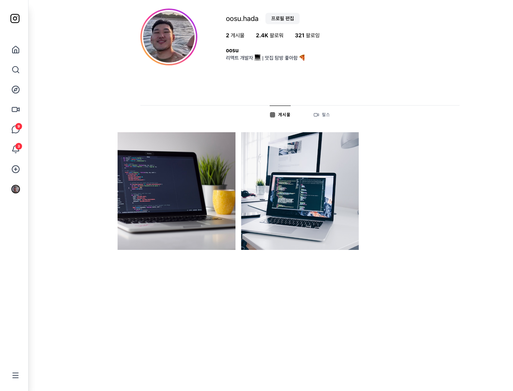
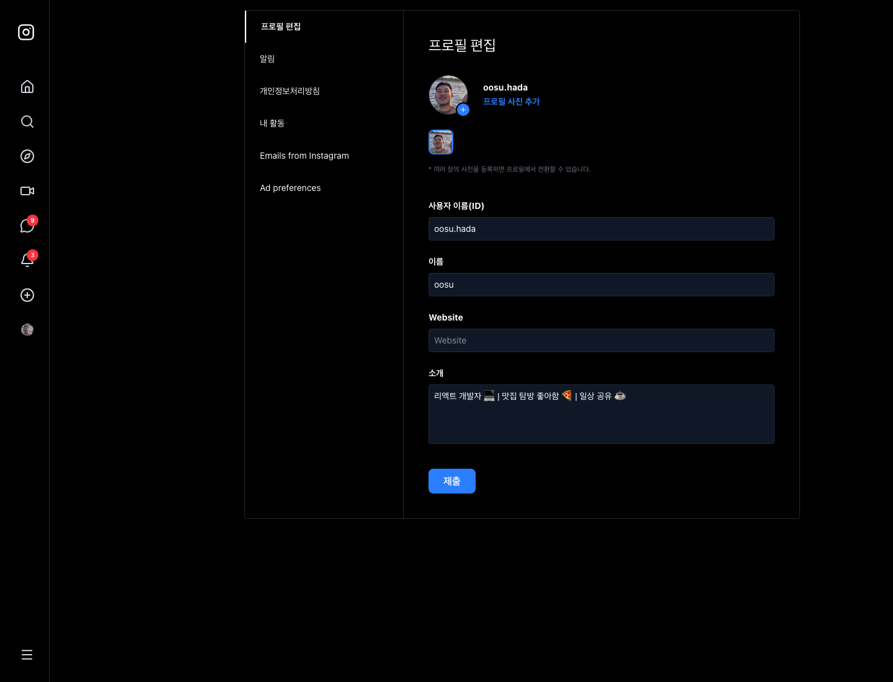
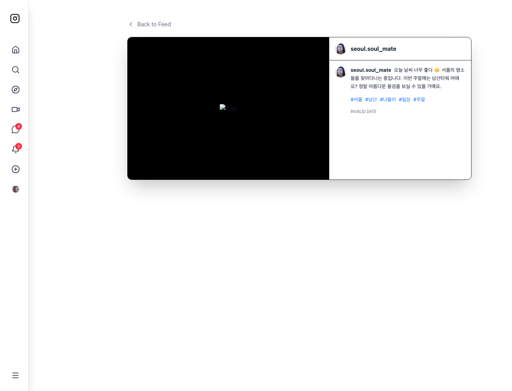
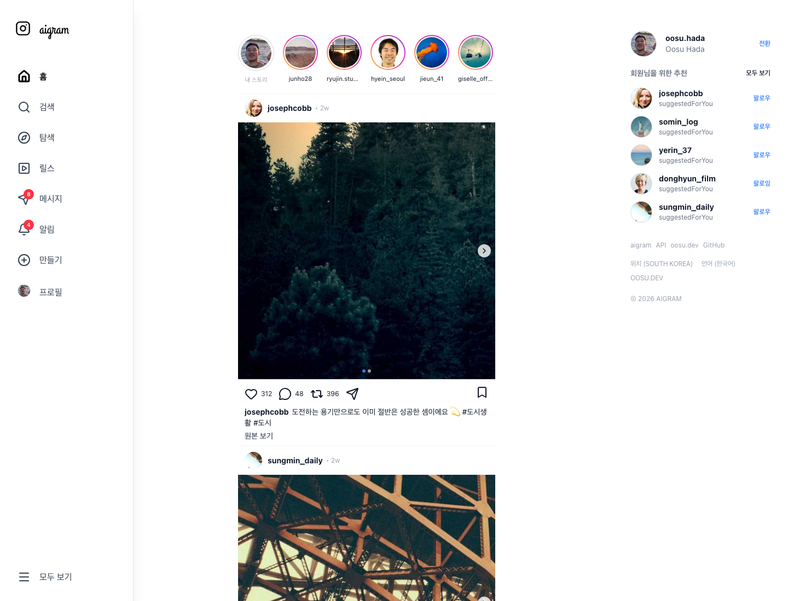
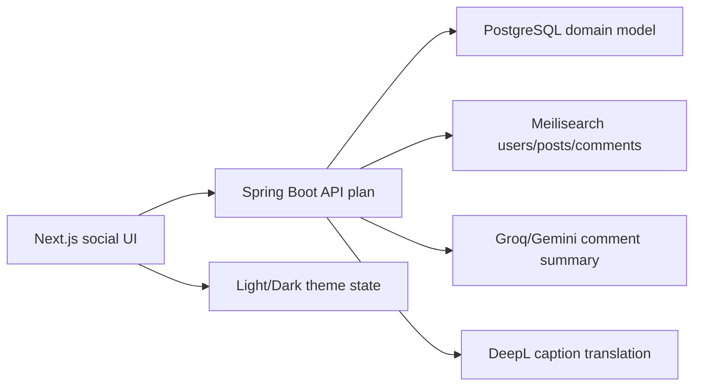

# Aigram

AI 기능을 붙인 Instagram 스타일 SNS 풀스택 포트폴리오 프로젝트입니다. Firebase 같은 managed backend를 연결해 쓰는 단계를 넘어, **처음으로 Java/Spring Boot 백엔드까지 직접 설계하며 만든 풀스택 프로젝트**라는 점이 이 작업에서 가장 중요한 출발점입니다.

## 왜 만들었나 / Why I built it

그 전까지는 UI/UX 중심으로 개발하거나 Firebase 같은 기존 서비스를 연결하고, 웹에서는 Next.js 정도로 backend 역할을 처리하는 경우가 많았습니다. 이 프로젝트에서는 처음으로 Java와 Spring Boot를 이용해 API와 데이터 구조까지 직접 만들면서 frontend와 backend가 실제로 어떻게 맞물리는지 끝까지 경험해 보고 싶었습니다.

주제는 단순 Instagram clone이 아니라 **“지금의 Instagram에서 불편한 부분을 미래의 AI 기능으로 보완한다면 어떨까?”**라는 상상에서 잡았습니다. 예를 들어 번역 품질을 더 자연스럽게 만들거나, 긴 본문과 댓글 흐름을 요약하고, 검색과 추천에서 AI가 맥락을 이해하게 하는 식입니다. 그래서 익숙한 SNS UX를 기반으로 시작하되, Java backend와 AI 기능을 함께 실험하는 첫 풀스택 작품으로 확장했습니다.

Aigram was my first project where I deliberately moved beyond attaching a managed backend and built the Java/Spring Boot side of the product myself. Instagram provided a familiar product surface, while the real experiment was imagining how AI could improve pain points such as translation quality, long-form content summarization, and contextual discovery.

[Live demo](https://aigram.oosu.dev)



## What This Shows

- Instagram과 유사한 정보 구조를 직접 구현하며 feed, story, reel, DM, profile, saved, settings 화면을 구성했습니다.
- light/dark mode를 전역 theme state와 Tailwind `dark:` 스타일로 지원했습니다.
- Spring Boot + PostgreSQL 기반의 fullstack 설계 문서를 함께 정리했습니다.
- Groq/Gemini 기반 AI 댓글 요약, DeepL 기반 캡션 번역, Meilisearch 검색 인덱싱 같은 확장 기능을 구현/문서화했습니다.
- 공개 repo에는 secret, private env, raw DB dump 없이 포트폴리오용 snapshot과 안전한 문서만 남겼습니다.

## Screenshots

### Main App Surfaces

| Feed light | Feed dark |
| --- | --- |
|  |  |

| Explore | Reels |
| --- | --- |
|  |  |

| Messages | Profile |
| --- | --- |
|  |  |

| Settings dark | Post detail |
| --- | --- |
|  |  |

### AI Features

| AI comment summary | Caption translation |
| --- | --- |
|  |  |

| Feature | Implementation note |
| --- | --- |
| AI comment summary | 댓글과 대댓글을 수집해 `/ai/comments/summary`로 보내고, Groq/Gemini provider를 env 기반으로 전환할 수 있게 설계했습니다. 동일 댓글 묶음은 `ai_comment_summaries` 캐시 구조로 비용과 지연을 줄입니다. |
| Caption translation | 게시물 caption을 `POST /translations` 흐름으로 요청하고, 번역 중/원문 보기/오류 상태를 게시물별 state로 관리합니다. |
| Search and indexing | users/posts/comments를 Meilisearch index로 나누어 검색하고, recent search와 검색 결과 화면 UX를 문서화했습니다. |
| AI-safe public sharing | provider key, Cloudinary secret, JWT secret, DB password는 repo에 넣지 않고 env/example/ops template 기준으로 분리했습니다. |

## Architecture

```text
Aigram/
├── app/                       # Next.js App Router public snapshot pages
│   ├── page.js                # feed route
│   ├── explore/page.js
│   ├── reels/page.js
│   ├── messages/page.js
│   ├── profile/page.js
│   ├── settings/page.js
│   └── p/[id]/page.js         # post detail route
├── src/
│   ├── components/            # feed, story, reel, sidebar, modal UI
│   ├── views/                 # earlier Vite route/view implementation
│   ├── context/               # theme/user/language shared state
│   └── data/                  # public-safe mock data
├── docs/                      # backend, DB, roadmap, AI/search notes
└── public/                    # local public assets
```



## Public Sharing Boundary

- 실제 provider key는 `GROQ_API_KEY`, `GEMINI_API_KEY`, `DEEPL_API_KEY`, `CLOUDINARY_API_SECRET`, `JWT_SECRET` 같은 env로만 주입합니다.
- 공개 repo에는 `.env`, production DB dump, private media, 운영 credential을 포함하지 않습니다.
- `NEXT_PUBLIC_*` 값은 브라우저에 노출되는 public config로만 사용하고, secret으로 취급되는 값은 서버 env에서만 읽도록 분리합니다.

## Run Locally

```bash
npm install
npm run dev
```

Open:

```text
http://localhost:3000
```

## Validate

```bash
npm run build
```
