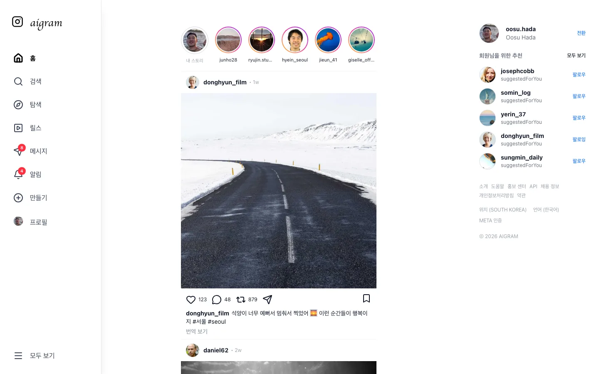
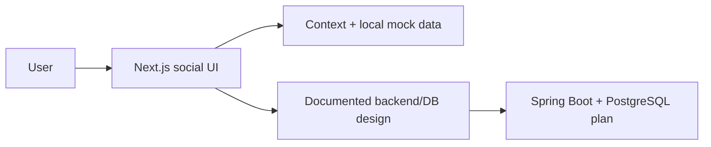

# Aigram

Public portfolio snapshot of an AI-assisted social media project inspired by Instagram interaction patterns. Aigram began as a frontend clone exercise and became a broader product study around feed UX, stories, reels, search, notifications, AI-assisted interactions, and social app information architecture.

[Live demo](https://aigram.oosu.dev)



## What This Shows

- Branded portfolio-ready surface after the rename from `InstaClone` to `Aigram`.
- Feed, stories, reels, profile, search, saved, settings, activity, report, and message surfaces.
- Next.js App Router migration artifacts alongside the earlier Vite learning path.
- Social-media domain modeling notes: users, posts, follows, comments, likes, stories, and search.
- Public-safe repository snapshot with local assets and no provider secrets.

## Main Screens

| Area | Portfolio value |
| --- | --- |
| Feed | Familiar SNS interactions, post cards, stories, side navigation |
| Profile | User-first routing and visual identity surfaces |
| Search | Discovery UX, recent search thinking, searchable social content |
| Stories/Reels | Media-forward interaction patterns |
| Messages | Product expansion beyond a static feed clone |
| Docs | ERD, architecture notes, setup guide, and implementation roadmap |

## Architecture Notes

```text
instagram-kosa-project/
├── app/                       # Next.js App Router pages
├── src/
│   ├── components/            # feed, story, create, layout, notification UI
│   ├── context/               # user/language/shared state
│   ├── data/                  # mock users, posts, translations
│   └── views/                 # earlier route/view implementation used by app routes
├── public/                    # local profile/favicon assets
└── docs/                      # architecture, setup, planning, database notes
```



## Security And Public Sharing Notes

- This public snapshot does not include private deployment secrets or provider API keys.
- Database passwords in docs are placeholders and should be replaced through environment variables in real deployments.
- Public tokens, if any are added later, should be treated as browser-visible and scoped accordingly.
- Keep `.env`, private media, deployment credentials, and raw production dumps out of git.

## Run Locally

```bash
npm install
npm run dev
```

Open:

```text
http://localhost:3000
```

## Validate

```bash
npm run build
```
