# Instagram 클론 - Mermaid 다이어그램 (Spring Boot & JPA 기반)

---

## 📊 1. ERD (Entity Relationship Diagram)
엔티티 간의 관계를 BIGINT PK와 Spring Data JPA 매핑 구조에 맞춰 설계했습니다.

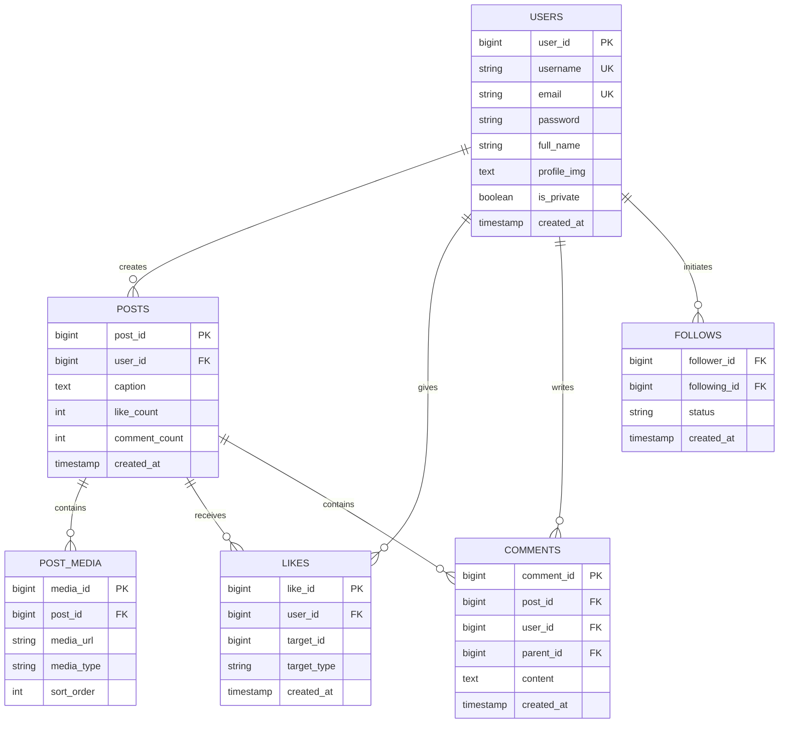

---

## 🔄 2. 데이터 흐름도 (피드 로드)
Next.js 프론트엔드가 Spring Boot 백엔드로부터 데이터를 가져오는 흐름입니다.

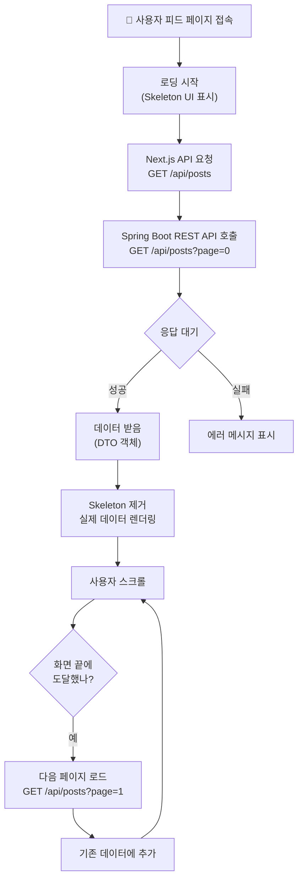

---

## ⚡ 3. Optimistic Update 흐름
사용자 경험을 극대화하기 위해 백엔드 API 응답 전 UI를 먼저 변경하는 로직입니다.

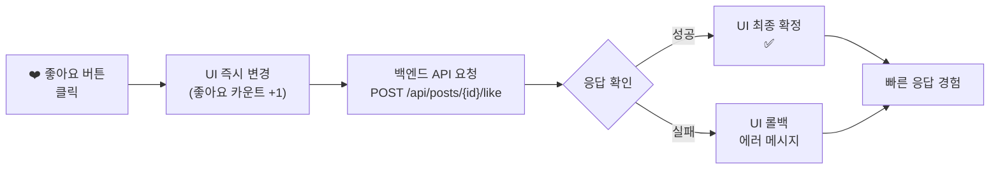

---

## 🗄️ 4. 1:N 관계 시각화 (User → Posts)
JPA의 `@OneToMany` 관계를 시각화한 구조입니다.

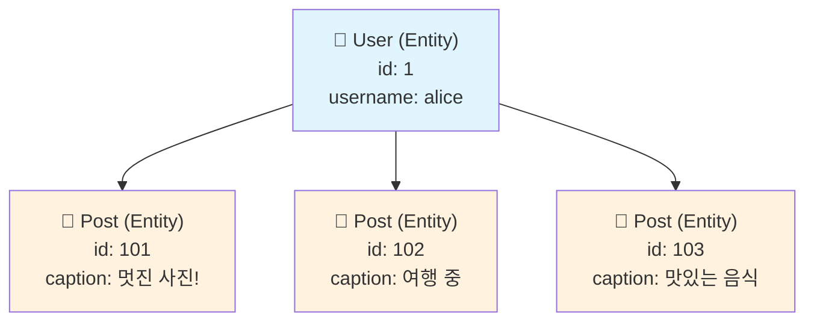

---

## 🔗 5. M:N 관계 시각화 (Likes)
좋아요 기능을 위한 다대다 관계 처리(중간 테이블) 구조입니다.

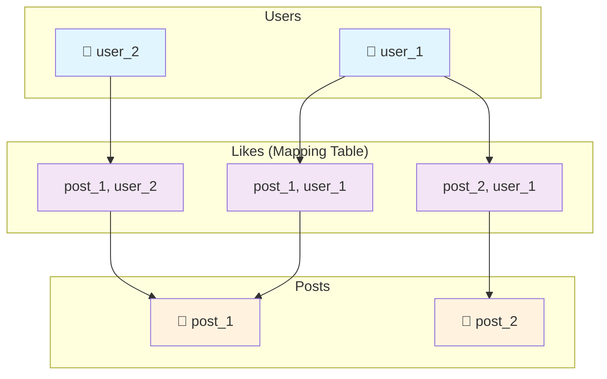

---

## 🔍 6. SQL 정규화 및 JPA 매핑 전략

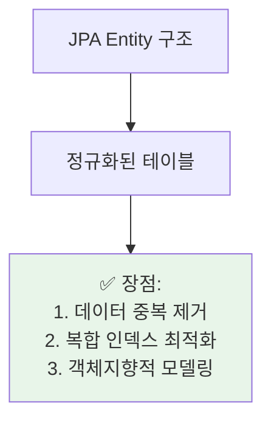

---

## 🚀 7. Spring Data JPA CRUD 사이클
리포지토리를 통한 데이터 접근 생명주기입니다.

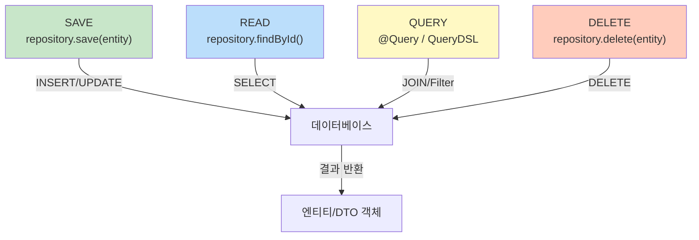

---

## 📈 8. 벌크 로드 프로세스 (Spring Boot)
대량의 더미 데이터를 주입하는 효율적인 과정입니다.

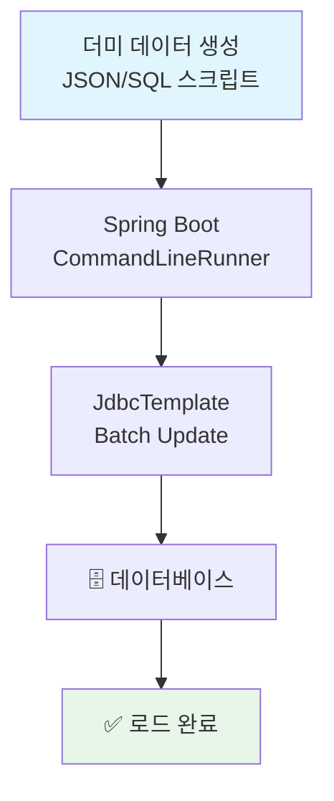

---

## 🏗️ 9. 전체 시스템 아키텍처
Next.js, Spring Boot, JPA, Cloudinary의 유기적인 결합도입니다.

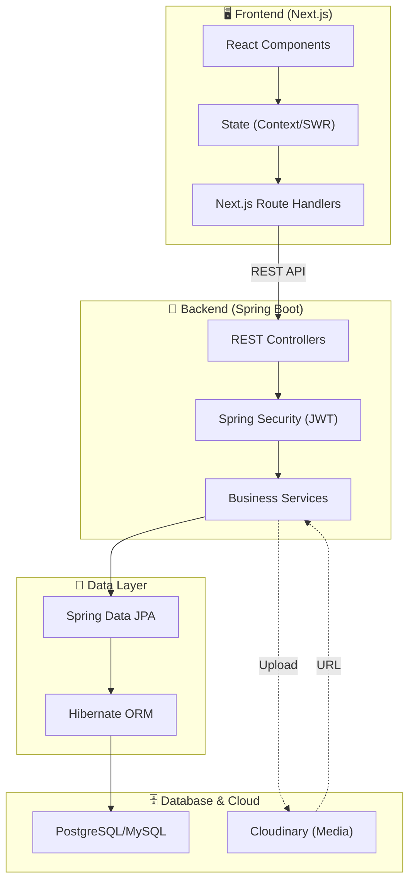

---

## 🔄 10. 팔로우/언팔로우 시퀀스
인증 정보와 상태 변화를 포함한 시퀀스 다이어그램입니다.

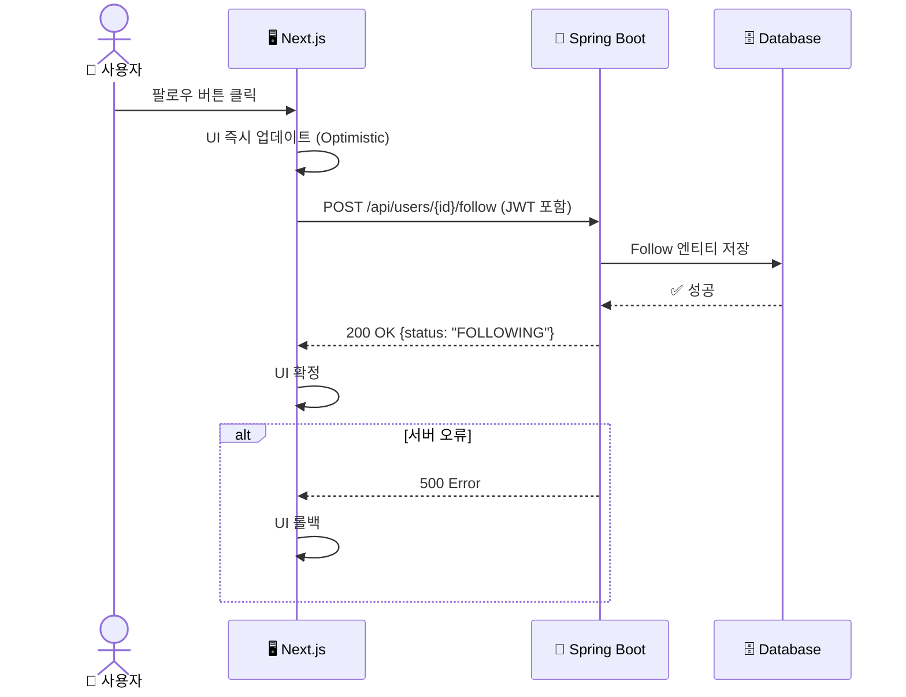

---

## 📊 11. 무한 스크롤 성능 (Pageable)

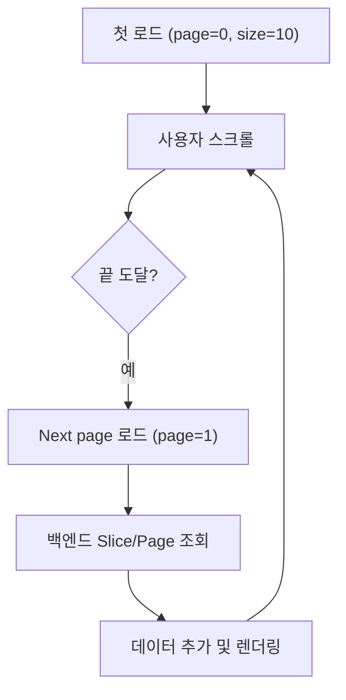

---

## 🎯 12. REST API 엔드포인트 맵

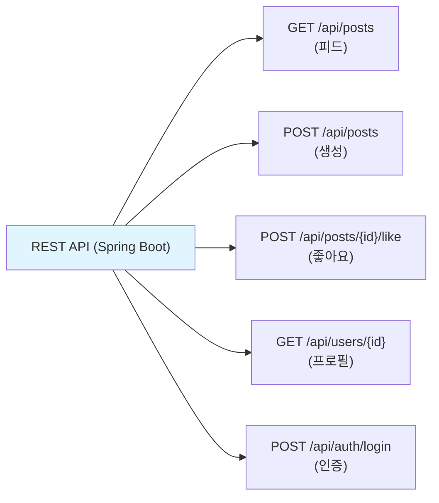

---

## 💾 13. 데이터 일관성 (JPA Cascade)

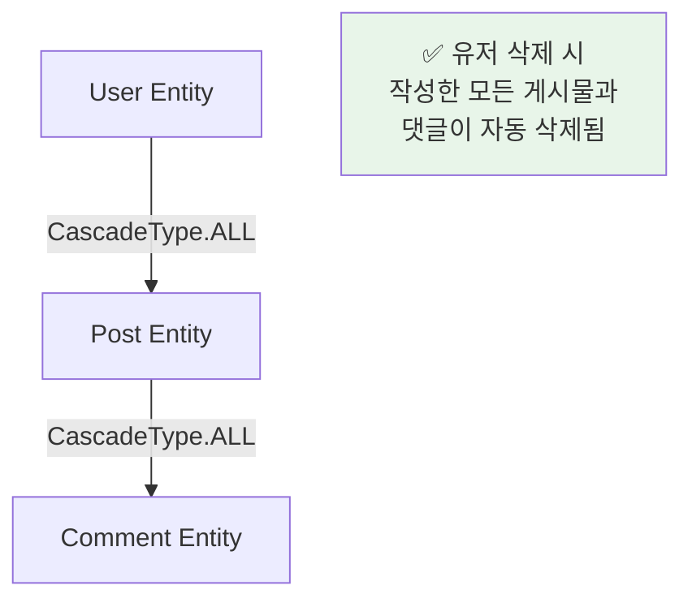

---

## 🎬 14. 이미지 업로드 플로우 (Cloudinary 연동)

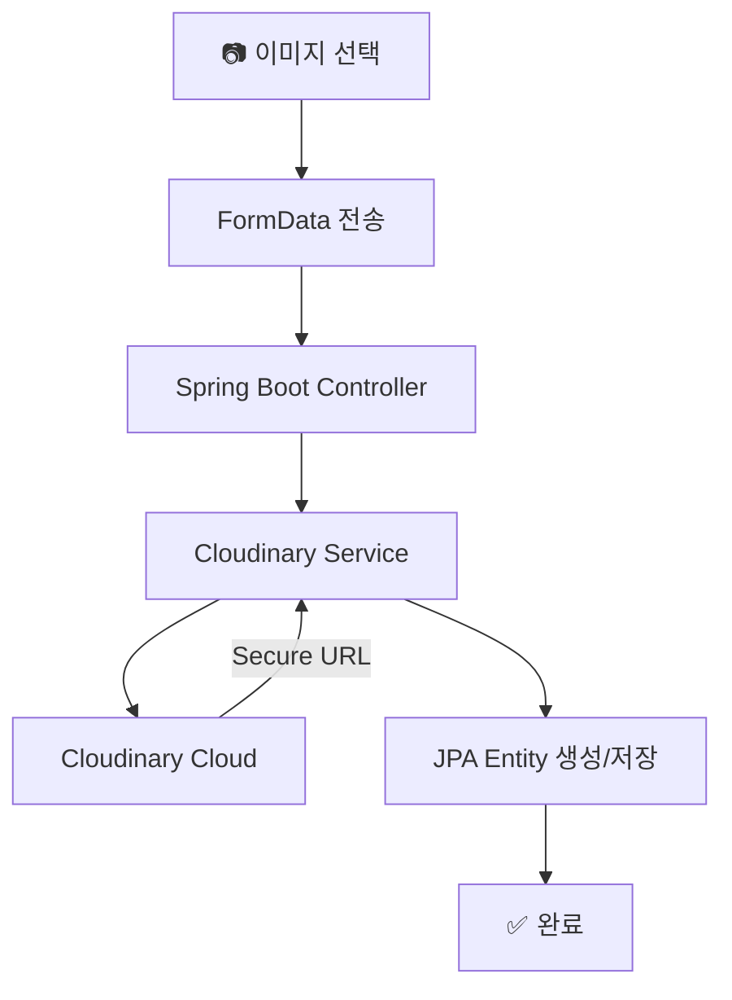

---

## 📱 15. 반응형 아키텍처

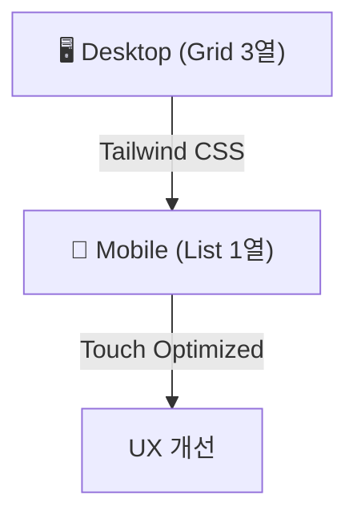

---

## ⚙️ 16. 성능 최적화 체크리스트 (Spring Boot)

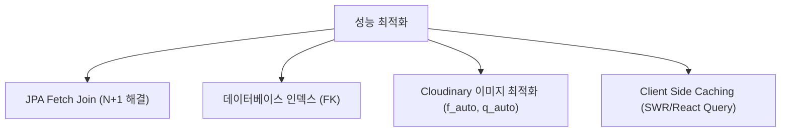
