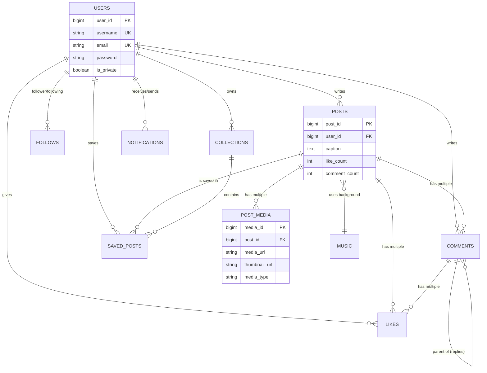

# docs/database/schema-diagram.md - 스키마 다이어그램 (Mermaid)

Aigram의 데이터베이스 구조를 시각화한 다이어그램입니다.

## 📊 ER 다이어그램

## 🛠 다이어그램 보는 법
- `||--o{`: 일대다 (1:N) 관계
- `PK`: Primary Key (기본키)
- `FK`: Foreign Key (외래키)
- `UK`: Unique Key (고유키)
